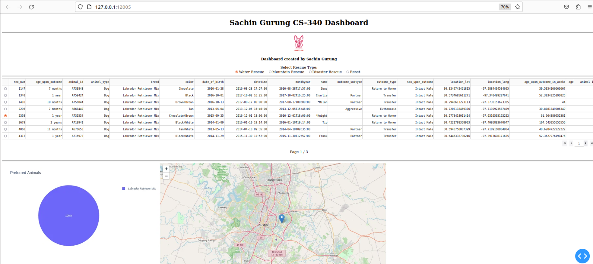

# CS 340 Project Two – Grazioso Salvare Interactive Dashboard

## Project Overview
This project is a web-based interactive dashboard. It connects to a MongoDB database containing animal shelter data and allows user to interact with the data through filters, graphs, data table and a geographic location map. The application supports pagination and filtering based on rescue types (Water, Mountain and Disaster).

---

## Tools Used

- **Python**:  
  Used as the main programming language for data processing and backend logic.

- **MongoDB**:  
  Used as the backend database and `pymongo` library is used to interface with MongoDB from Python.

- **Dash**:  
  Used to create front-end interface. It supports both the view (HTML, graphs, maps) and controller (callbacks) components of the application.

---

## Functionality

- Interactive filtering of animals by rescue type  
- Data table with 8 results per page
- Page number display (e.g. Page 1 / 3)
- Pie chart showing breed distribution  
- Geographic map showing location of selected animal  
- Custom styling and integration of a company logo

---

## Why MongoDB Was Used

MongoDB is a flexible, document-based NoSQL database. It is ideal for this application because it stores data in a JSON-like format, which is easy to process in Python using dictionaries. It allows for powerful queries using `pymongo` library. It also supports flexible schema, ideal for varying animal attributes. 

---

## Why Dash Framework Was Used

Dash provides a powerful framework for building interactive web applications in Python. It allows combining Python backend with HTML/CSS front-end without switching languages. It uses callbacks to handle user interactions such as radio buttons and pagination. It also supports real-time updates and visuals using `Plotly`.

---

## Steps Taken to Complete the Project

1. Connected to MongoDB using the `AnimalShelter` CRUD class.
2. Queried data using filters for Water, Mountain and Disaster rescue types.
3. Displayed data in a paginated table with selectable rows.
4. Added pie chart based on filtered data using `plotly.express`.
5. Implemented map view to show animal location using `dash_leaflet`.
6. Displayed current page number using a callback.
7. Added the Grazioso Salvare logo and personalized dashboard title.

---

## Challenges Encountered

- **Pagination and Filtering**  
  Initially, the table returned all data at once and slowed down the UI. This was resolved by enabling `page_action= ‘custom’` and slicing the dataframe for each page.

- **Page Number Display**  
  It didn’t show how many total pages were there. This was handled by creating a separate callback to calculate total records and pages manually.

---

## How to Run This App

1. Open Jupyter Notebook.
2. Ensure all dependencies are installed i.e. dash, pandas, dash_leaflet, plotly, jupyter_dash, pymongo.
3. Place the logo image file in the same folder i.e. `GraziosoSalvareLogo.png`
4. Run the notebook containing the dashboard code.
5. The app will open in a local browser tab.

---

## Screenshots

### Starting state of my dashboard:

### Starting state of my dashboard with one row selected:

### Water Rescue filter applied:

### Water Rescue filter and one row selected:

### Mountain Rescue filter applied:

### Mountain Rescue filter and one row selected:

### Disaster Rescue filter applied:

### Disaster Rescue filter and one row selected:

